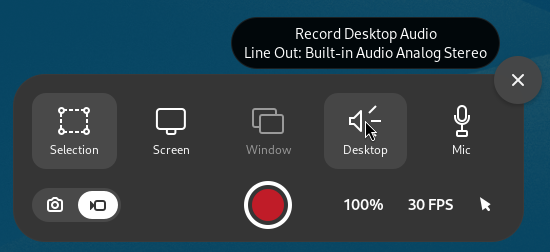
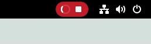

# Screencst with Extra feature.

Adds extra features in gnome-shell's built-in screen cast feature.

- Record Audio with it.
- Specify framerate. (Up to 60 Hz.)
- Downsize resolution. (75%, 50% or 33%)
- Quick Stop by pressing screen cast key. (Usually <kbd>Shift + Ctrl + Alt + R</kbd>)

This is to aid simple use-cases, like simply recording some screen to share.

## Build and Install


```
# Build
./build.sh

# Install 
gnome-extensions install screencast.extra.feature@wissle.me-shell-extension.zip
```

## UI

### Main UI

UI of Built-in Screencast feature has top part and bottom part. This extension
adds additonal UI on these.



1.  Top Part

    Two additional selectors for sound record. Each can be turned on or off
    individually.

    - Desktop: Record Desktop Sound, which is what you listen from speaker,
      like games, videos.

    - Mic: Record Mic Sound, which is what you say to microphone.
       
2.  Bottom Part

    Additional option for screen cast.

    - 100%: Downsize screen cast resolution. (Lesser pixels for video) Supported
      to 33%.

    - FPS: Framerate for screen cast. (How many pictures per seconds) Supported
      up to 60 Hz.

### Indicator



If pipeline is being prepared, this will show spinning animation instead of
time.

Once pipeline is ready and record starts, recording time will show up.
