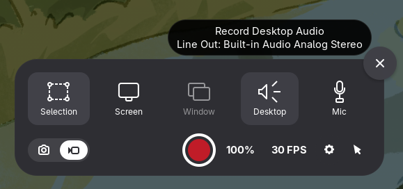
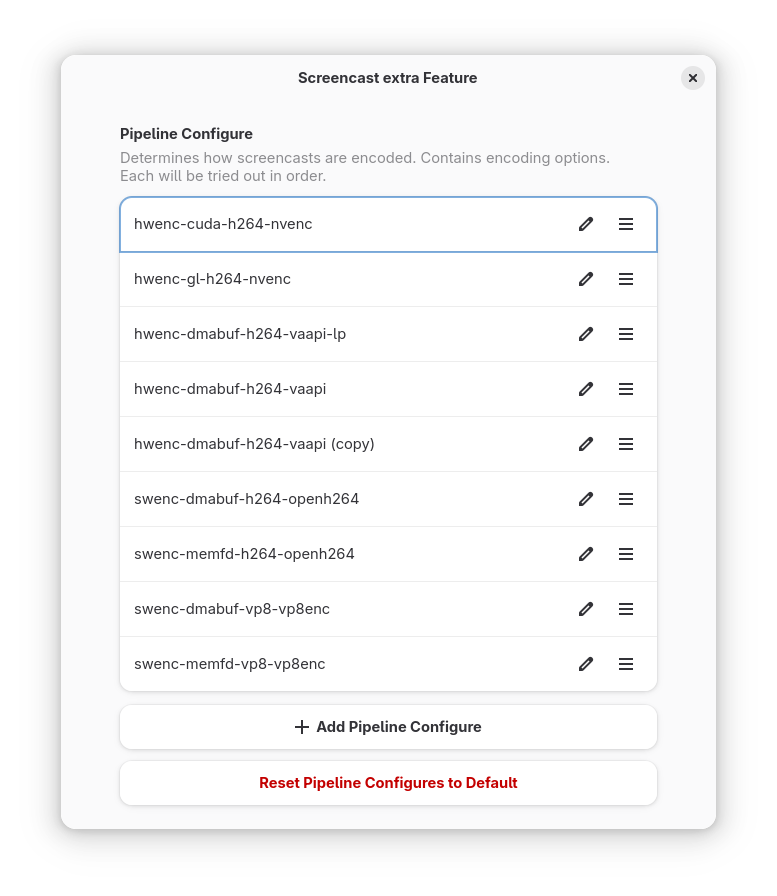
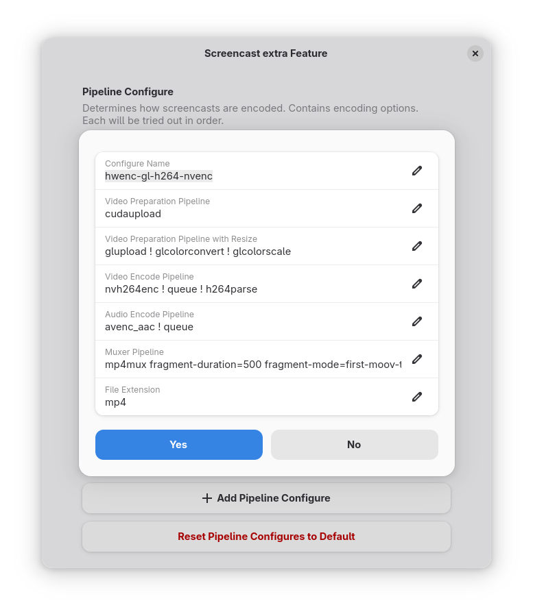
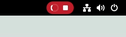

# Screencast with Extra feature.

Adds extra features in gnome-shell's built-in screen cast feature.

- Record Audio with it.
- Specify framerate. (Up to 60 Hz.)
- Downsize resolution. (75%, 50% or 33%)
- Quick Stop by pressing screen cast key. (Usually <kbd>Shift + Ctrl + Alt + R</kbd>)

This is to aid simple use-cases, like simply recording some screen to share.

## Build and Install


```
# Build
./build.sh

# Install 
gnome-extensions install screencast.extra.feature@wissle.me-shell-extension.zip
```

## UI

### Main UI

UI of Built-in Screencast feature has top part and bottom part. This extension
adds additonal UI on these.



1.  Top Part

    Two additional selectors for sound record. Each can be turned on or off
    individually.

    - Desktop: Record Desktop Sound, which is what you listen from speaker,
      like games, videos.

    - Mic: Record Mic Sound, which is what you say to microphone.
       
2.  Bottom Part

    Additional option for screen cast.

    - 100%: Downsize screen cast resolution. (Lesser pixels for video) Supported
      to 33%.

    - FPS: Framerate for screen cast. (How many pictures per seconds) Supported
      up to 60 Hz.

    - Preferences: Open Preferences window.

### Preferences

#### Pipeline Options



Can control pipeline options to determine how to encode video and audio into
file.

- list of pipeline configure to try. Tried from top to bottom.
- Add new pipeline configure.
- Reset all pipeline configure as default.



Clicking on pipeline configure, or add button, would show this.

- **Configure Name:** Name of the configure.

- **Video Preparation Pipeline:** Prepares the video for encoder. Usually
    convert color space, and upload to specific memory if needed.

- **Video Preparation Pipeline with Resize:** Prepares the video for encoder.
    This one adds resizing video. This is used if downsizing is set.

- **Video Encode Pipeline:** Encodes the prepared video to put in container.

- **Audio Encode Pipeline:** Encodes the audio to put in container.
    Only used if recording audio. (Desktop Sound, or microphone)

- **Muxer Pipeline:** Put encoded video and audio into container.

- **File Extension:** File extension for saved video file.

Video Preparation Pipeline and Video Encode Pipeline is separated for the reason...

- Preparation Pipeline shared among configure.
- Might need some different preparation, for down-sizing.


### Indicator



If pipeline is being prepared, this will show spinning animation instead of
time.

Once pipeline is ready and record starts, recording time will show up.

## What is actually happening.

Gnome Shell comes with some services that runs in separated process.

Screen Cast feature is also runs in separated process, and Gnome Shell passes
options for recording.

Fortunately, pipeline description can be passed as an option.

This extension just modifies UI and the option that passed.
 
